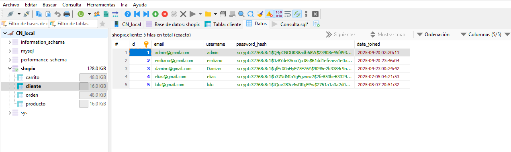

#  Shopix: Full-Stack E-commerce 

Plataforma integral de comercio electrónico desarrollada con **Python (Flask)**. Este sistema implementa un flujo completo de ventas, desde la navegación dinámica de productos hasta la persistencia de datos en una arquitectura relacional segura.

##  Características Principales
* **Navegación Dinámica:** Menú lateral interactivo con filtrado por categorías (Gaming, Electrónica, Hogar, etc.).
* **Experiencia de Usuario (UX):** Diseño responsivo con sliders promocionales, gestión de carritos y perfiles de usuario.
* **Seguridad de Datos:** Autenticación robusta con manejo de sesiones y encriptación de credenciales.
* **Gestión de Inventario:** Catálogo conectado en tiempo real con la base de datos para control de stock.

## Vista del Sistema

| Interfaz de Usuario (Frontend) | Arquitectura de Base de Datos (Backend) |
| :---: | :---: |
|  |  |
| *Catálogo dinámico y Dashboard de ventas* | *Estructura relacional y seguridad en HeidiSQL* |

## Stack Tecnológico
* **Backend:** Python 3.10+ & Flask.
* **Frontend:** HTML5, CSS3 (Bootstrap 5) y JavaScript.
* **Base de Datos:** MariaDB(Gestión profesional vía HeidiSQL).
* **Seguridad:** Hashing de contraseñas mediante algoritmos **Scrypt** (Protección contra ataques de fuerza bruta).

## Detalles de Ingeniería (Backend)
Este proyecto destaca por su enfoque en la **integridad y seguridad de la información**:
1. **Normalización de Datos:** Base de datos estructurada en tablas relacionales (`clientes`, `productos`, `ordenes`) para optimizar consultas y evitar redundancia.
2. **Ciberseguridad:** Implementación de `password_hash` para asegurar que las contraseñas de los usuarios nunca se almacenen en texto plano, cumpliendo con estándares de la industria.
3. **Escalabilidad:** Arquitectura modular que permite agregar nuevas categorías y funcionalidades de pago de manera sencilla.

##  Instalación y Uso
1. Clonar el repositorio:
   ```bash
   git clone [https://github.com/Emi659/E-commerce.git](https://github.com/Emi659/E-commerce.git)
